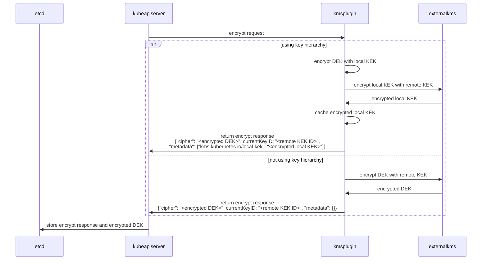
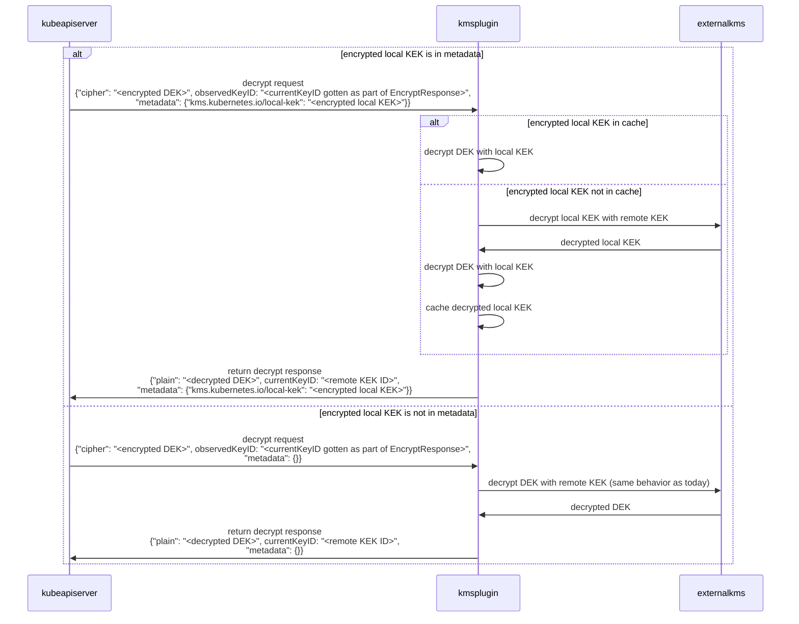

# Sequence diagrams

## Encrypt Request

```mermaid
sequenceDiagram
    participant etcd
    participant kubeapiserver
    participant kmsplugin
    participant externalkms
    kubeapiserver->>kmsplugin: encrypt request
    alt using key hierarchy
        kmsplugin->>kmsplugin: encrypt DEK with local KEK
        kmsplugin->>externalkms: encrypt local KEK with remote KEK
        externalkms->>kmsplugin: encrypted local KEK
        kmsplugin->>kmsplugin: cache encrypted local KEK
        kmsplugin->>kubeapiserver: return encrypt response <br/> {"cipher": "<encrypted DEK>", currentKeyID: "<remote KEK ID>", <br/> "metadata": {"kms.kubernetes.io/local-kek": "<encrypted local KEK>"}}
    else not using key hierarchy
        %% current behavior
        kmsplugin->>externalkms: encrypt DEK with remote KEK
        externalkms->>kmsplugin: encrypted DEK
        kmsplugin->>kubeapiserver: return encrypt response <br/> {"cipher": "<encrypted DEK>", currentKeyID: "<remote KEK ID>", "metadata": {}}
    end
    kubeapiserver->>etcd: store encrypt response and encrypted DEK
```

## Decrypt Request

```mermaid
sequenceDiagram
    participant kubeapiserver
    participant kmsplugin
    participant externalkms
    %% if local KEK in metadata, then using hierarchy
    alt encrypted local KEK is in metadata
      kubeapiserver->>kmsplugin: decrypt request <br/> {"cipher": "<encrypted DEK>", observedKeyID: "<currentKeyID gotten as part of EncryptResponse>", <br/> "metadata": {"kms.kubernetes.io/local-kek": "<encrypted local KEK>"}}
        alt encrypted local KEK in cache
            kmsplugin->>kmsplugin: decrypt DEK with local KEK
        else encrypted local KEK not in cache
            kmsplugin->>externalkms: decrypt local KEK with remote KEK
            externalkms->>kmsplugin: decrypted local KEK
            kmsplugin->>kmsplugin: decrypt DEK with local KEK
            kmsplugin->>kmsplugin: cache decrypted local KEK
        end
        kmsplugin->>kubeapiserver: return decrypt response <br/> {"plain": "<decrypted DEK>", currentKeyID: "<remote KEK ID>", <br/> "metadata": {"kms.kubernetes.io/local-kek": "<encrypted local KEK>"}}
    else encrypted local KEK is not in metadata
        kubeapiserver->>kmsplugin: decrypt request <br/> {"cipher": "<encrypted DEK>", observedKeyID: "<currentKeyID gotten as part of EncryptResponse>", <br/> "metadata": {}}
        kmsplugin->>externalkms: decrypt DEK with remote KEK (same behavior as today)
        externalkms->>kmsplugin: decrypted DEK
        kmsplugin->>kubeapiserver: return decrypt response <br/> {"plain": "<decrypted DEK>", currentKeyID: "<remote KEK ID>", <br/> "metadata": {}}
    end
```
